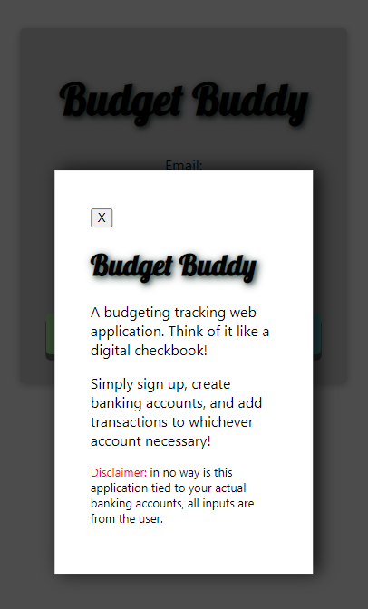
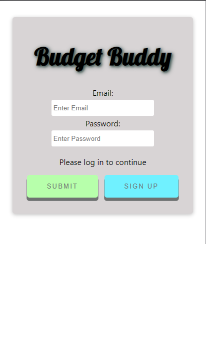
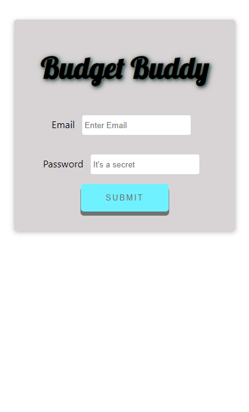
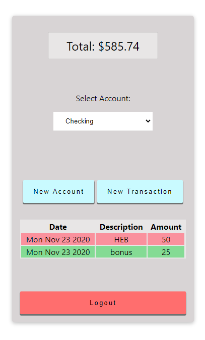
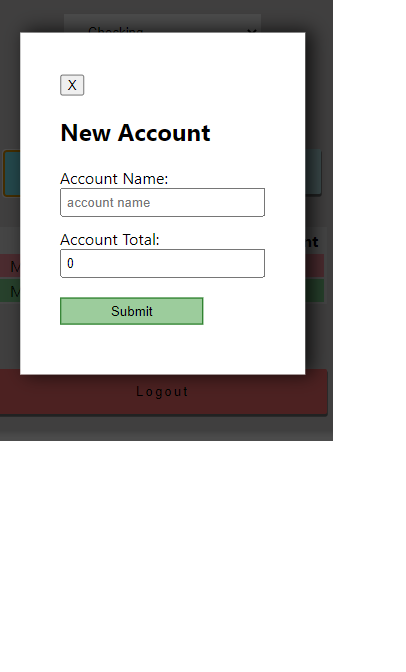

# Budget Buddy Server

**[Budget Buddy](https://budget-buddy.vercel.app/)**

**Summary**

This application was built for budgeting and financing tracking purposes. The idea was to eliminate the hidden "processing delay" from your banking applications, by enabling the user to fully control their financing.

This application was built using React, Node, PostgreSQL, and Express.

## API Documentation

### Accounts Routes

GET /api/accounts returns an array of accounts assigned to the unique user

POST /api/accounts allows to post an account name and initial total attached to the user id

### Auth Routes

POST /api/login allows to user to login using email and password, password is compared to stored hashed password in DB, as well as the users email.

### Transaction Routes

All routes for transactions require JWT authentication
GET /api/transactions/:account_id returns an array of transactions attached to the account_id that have a valid user id

POST /api/transactions allow for DB insertion of amount, type, description from body, and is attached to account id.

