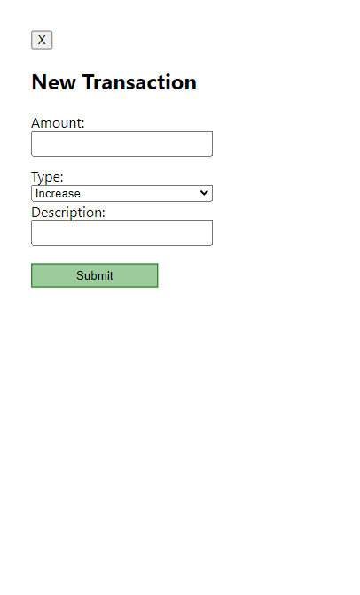

# Budget Buddy Server

**[Budget Buddy](https://budget-buddy.vercel.app/)**

**Summary**

This application was built for budgeting and financing tracking purposes. The idea was to eliminate the hidden "processing delay" from your banking applications, by enabling the user to fully control their financing.

This application was built using React, Node, PostgreSQL, and Express.

## API Documentation

### Accounts Routes

GET /api/accounts - Returns an array of accounts(objects), with key value of account names, and account totals assigned to the unique user.

POST /api/accounts - Post an account with account name and account total.

### Auth Routes

POST /api/login - Post email and password credentials allow the user to login using email and password, password is compared to stored hashed password in DB, as well as the users email.

### Transaction Routes

All routes for transactions require JWT authentication.

GET /api/transactions/:account_id - Returns an array of transactions attached to the account_id that have a valid user id.

POST /api/transactions - Post a transaction linked to an account ID given by the params.

